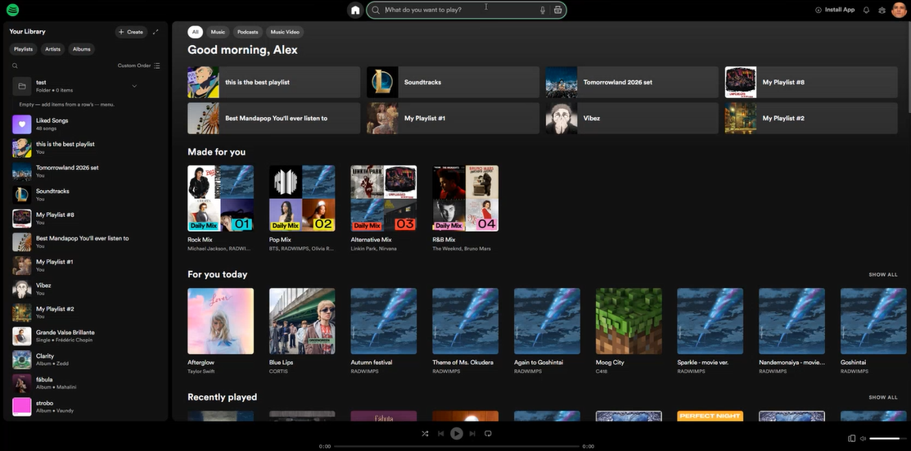

# 🎵 not-spotify

Definitely not Spotify, a Supabase-backed local music streaming web application with an ASP.NET Core Web API backend and React + TypeScript + Vite frontend.



## Run Locally

Follow **[Getting Started](#-getting-started)** below to run the same app on your machine (or **[Run everything at once](#run-everything-at-once-quickest-start)** for the one-command start).

> This branch runs the frontend and backend on localhost and uses Supabase PostgreSQL plus Supabase Storage. See [`docs/supabase-local-setup.md`](docs/supabase-local-setup.md).

---

## 📊 Project Status & Features

This README covers what the project *is* and how to run it; architecture notes for new contributors are in the [Architecture & Conventions](#architecture--conventions) section below.

**What works today (highlights):**
- **Playback:** full player, queue + premium drag-reorder, **crossfade + gapless**, PiP + OS media keys, sleep timer, playback speed, play-next, autoplay, keyboard shortcuts (`?` for help), star ratings, voice search.
- **Discovery:** trending, for-you, new music, recents, **weekly Top 50 charts**, **search by lyrics**, **song radio**, **"Fans also like"**, **Daily Mixes**, **"Popular in {country}"** (location-based).
- **Library/playlists:** create/edit/delete, **smart playlists** (genre/rating/play-count/date-added rules), public/friends/private visibility, collaborative playlists, JSON export/import, library + track sorting, cover-art mosaics.
- **Social:** friends, **asymmetric follows** (follower/following counts + public profile top tracks), real-time presence, Friend Activity rail, 1:1 chat, notifications center, friends-only playlists, Blend, listen-along/Jam.
- **Lyrics:** karaoke synced lyrics (highlight + auto-scroll + click-to-seek).
- **Personalization:** light/dark, dynamic cover-art theming, personal listening stats (mini-Wrapped), live language selector (en/es/fr across Settings, shell navigation, Home, Search, and Library).
- **Artist/Admin:** artist dashboard (uploads, edits, resubmissions), application→review flow, admin CRUD + approval queue + audit history, dedicated `/admin/login`; **RBAC** — a master-admin tier that grants/revokes admin, with a `PendingAction` approval queue (a regular admin's grant/revoke enqueues for master sign-off) and Team & Approvals admin pages.
- **Platform:** installable **PWA** with offline app shell + premium **offline audio** (Range-aware playback); **embeddable iframe mini-player** (`/embed/track/:id`, copy-embed-code from any track page); **podcasts** (`/podcasts` catalogue + show pages, episodes play through the same audio engine as tracks); **personal uploads locker** (`/uploads` — upload your own audio outside the public catalogue and play it); **music videos** (`/videos` catalogue + watch pages with a `<video>` player that pauses audio playback); **audio ads engine** (free tier hears a house ad every N tracks via a separate non-skippable ad player; premium is genuinely ad-free; admin ad CRUD + weighted/targeted serving).

- **Desktop:** optional **Tauri** wrapper (`frontend/src-tauri`) that loads the same frontend in a native window — see [Desktop app (Tauri)](#desktop-app-tauri-optional).

**Being worked on next:** remaining i18n coverage (player/detail/profile/admin views) and a deeper unit-test suite.

### Run everything at once (quickest start)

**Open [Git Bash](https://git-scm.com/downloads) at the repo root and run:**
```bash
./dev.sh
```
That launches all three services in their own windows — backend (`https://localhost:7045`), Stripe webhook listener, and frontend (`http://localhost:5173`) — so you don't need three manual terminals.

**On plain Windows** (no Git Bash), open **PowerShell** at the repo root and run:
```powershell
.\dev.cmd
```
or just **double-click [`dev.cmd`](dev.cmd)** in Explorer — same thing.

- Requires .NET SDK, Node/npm, and (for the webhook window) the Stripe CLI on your PATH, with `stripe login` done once. **Not testing premium?** Just ignore/close the Stripe window — backend + frontend still run fine.
- Prefer manual control, or first-time setup? Follow the step-by-step below.
- **Stripe products/prices to create:** see [`docs/stripe-setup.md`](docs/stripe-setup.md).

---

## 🚀 Getting Started

To get both the frontend and backend running locally on your machine, follow these instructions.

### 1. Prerequisites
Ensure you have the following installed:
* [.NET 8.0 SDK](https://dotnet.microsoft.com/download/dotnet/8.0)
* [Node.js (LTS)](https://nodejs.org/)

> **Database and media:** This branch uses Supabase PostgreSQL and Supabase Storage. You do not need PostgreSQL installed locally. See [`docs/supabase-local-setup.md`](docs/supabase-local-setup.md).

---

### 2. Backend Setup & Run

1. Open a terminal and navigate to the backend project API directory:
   ```bash
   cd backend/src/NotSpotify.Api
   ```

2. Configure your Supabase database, storage, and JWT secret via **dotnet user-secrets** (these stay on your machine, outside the repo):
   ```bash
   dotnet user-secrets set "ConnectionStrings:Postgres" "Host=<session-pooler-host>;Port=5432;Database=postgres;Username=<session-pooler-user>;Password=<database-password>;SSL Mode=Require;Trust Server Certificate=true"
   dotnet user-secrets set "Jwt:SigningKey" "a-very-long-random-string-at-least-32-chars-long"
   dotnet user-secrets set "SupabaseStorage:ProjectUrl" "https://msounbcyosxzypmewacy.supabase.co"
   dotnet user-secrets set "SupabaseStorage:BucketName" "not-spotify-media"
   dotnet user-secrets set "SupabaseStorage:ServiceRoleKey" "sb_secret_your_server_only_key"
   ```
   Replace the placeholder values with your Supabase credentials. Use the **Session pooler** connection details from Supabase on port `5432`; the direct `db.<project-ref>.supabase.co` endpoint may be IPv6-only. Create a public `not-spotify-media` bucket first. Use a Supabase `sb_secret_...` key or legacy `service_role` key, never the `sb_publishable_...` key.

   Verify the secrets were saved:
   ```bash
   dotnet user-secrets list
   ```

3. Trust the local HTTPS development certificate:
   ```bash
   dotnet dev-certs https --trust
   ```

4. Start the backend:
   ```bash
   dotnet run
   ```
    On first run, EF Core auto-applies all migrations and `DbSeeder` populates artists/albums/tracks/playlists/genres + the demo admin user. No manual `dotnet ef database update` is needed; the schema and seed data are created in your Supabase project.

   *The API will compile and run on **`https://localhost:7045`** (and Swagger UI will be available at [https://localhost:7045/swagger](https://localhost:7045/swagger)).*

> **Heads up — Supabase data.** This branch writes to your Supabase project. For destructive testing, use a throwaway project or coordinate before deleting catalogue data.

---

### 3. Frontend Setup & Run

1. Open a new terminal and navigate to the frontend directory:
   ```bash
   cd frontend
   ```

2. Install dependencies:
   ```bash
   npm install
   ```
   This installs the frontend runtime packages already listed in `frontend/package.json`, including:
   - `@fontsource-variable/montserrat` for the local Montserrat font.
   - `node-vibrant` for cover-art colour extraction.

   The Picture-in-Picture mini-player (opened from the player bar's PiP button) uses browser APIs (Picture-in-Picture + Media Session). It does not require an npm dependency, but works best in Chrome or Edge on `localhost`/HTTPS. Once opened it persists as a floating window across tabs/windows until you close it.

3. Verify or configure your local environment settings in `frontend/.env.development`:
   ```env
   VITE_USE_MOCK=false
   VITE_API_URL=https://localhost:7045
   ```

4. Start the frontend development server:
   ```bash
   npm run dev
   ```
   *The client will start running on **`http://localhost:5173`**.*

---

### Optional: Google Login

Google login needs an **External** Google Auth Platform audience, a Web OAuth client, and matching local user-secrets.

1. Open the [Google Auth Platform Audience page](https://console.cloud.google.com/auth/audience) and set **User type** to **External**. For local testing, keep the publishing status as **Testing** and add your Google account as a test user.
2. Open [Google Cloud Credentials](https://console.cloud.google.com/apis/credentials), create an **OAuth client ID** for a **Web application**, and add this exact redirect URI:
   ```text
   https://localhost:7045/auth/external/google/callback
   ```
3. Save the client ID and client secret locally:
   ```powershell
   cd backend/src/NotSpotify.Api
   dotnet user-secrets set "Authentication:Google:ClientId" "<client-id>.apps.googleusercontent.com"
   dotnet user-secrets set "Authentication:Google:ClientSecret" "<google-client-secret>"
   dotnet user-secrets set "Authentication:Google:RedirectUri" "https://localhost:7045/auth/external/google/callback"
   ```
4. Restart the backend, sign in as `alex@example.com`, and open **Admin → Dev Tools → Social login providers**. Enable Google after the row reports **credentials configured**.

The frontend checks `GET /auth/external/providers`, so the Google button appears only when credentials are configured and the provider is enabled. Do not use a Supabase key for Google OAuth.

See [`docs/auth-setup.md`](docs/auth-setup.md) for the OAuth flow and troubleshooting notes.

---

### Desktop app (Tauri, optional)

The same React frontend can run as a native desktop window via [Tauri](https://tauri.app) v2. The wrapper lives in [`frontend/src-tauri`](frontend/src-tauri) and embeds the **already-built `dist/`** — it adds no second copy of the UI and no web server, just a native window around the PWA.

**Prerequisites (one-time):**
- [Rust](https://www.rust-lang.org/tools/install) (stable, `rustup`).
- On Windows: the **WebView2 runtime** (preinstalled on Windows 10/11).
- `npm install` in `frontend/` (installs the `@tauri-apps/cli` dev dependency).

**Run it (from `frontend/`):**
```bash
npm run tauri:dev     # launches the Vite dev server + a native window (hot reload)
npm run tauri:build   # builds a local production installer
```

- **It talks to the same local backend.** `tauri:dev` loads `http://localhost:5173` and uses `.env.development`; `tauri:build` uses the localhost API from `.env.production`. The desktop app is a client, not a server.
- **Downloads:** `/download` offers the local installable PWA and any desktop artifacts produced by Tauri.
- **Icons** are derived from the PWA icons by [`src-tauri/icons/generate-icons.mjs`](frontend/src-tauri/icons/generate-icons.mjs) (re-run with `node generate-icons.mjs` if the source art changes).
- `src-tauri/target/` is git-ignored; `Cargo.lock` is committed (this is an application crate).

---

### 🔑 Seed Login Credentials

The login page shows **Dev shortcuts** buttons (visible only in `npm run dev` mode) for one-click login into any of the accounts below.

| Account | Email | Password | Role |
|---|---|---|---|
| alex | `alex@example.com` | `Password123!` | Admin + Artist |
| testing1 | `testing1@example.com` | `Testing1` | User |
| testing2 | `testing2@example.com` | `Testing2` | User |

> All three are created automatically by `DbSeeder` on backend startup — so they work even against a brand-new empty Supabase database. Their passwords are kept at the documented defaults on every boot; don't change them or you'll break the shortcuts for your teammates.

---

## Free vs Premium Tier

### Feature Comparison

| Feature | Free | Premium |
|---|---|---|
| Listening | Playlists only, **shuffle forced on** | Any order, any source |
| Shuffle | Always on, cannot be turned off | Toggle on/off |
| Repeat | Not available (locked) | Repeat all / repeat one |
| Track selection | Random start — clicking a specific track shuffles the whole playlist | Play any track directly |
| Audio ads | Plays a house ad every N tracks | **Ad-free** — never interrupted |
| Downloads | ✗ | Download songs, albums, and playlists as ZIP files |
| Liked Songs | Full access — like, unlike, view | Full access |
| Save albums | Full access | Full access |
| Playlist management | Create, edit, add/remove songs, set cover, visibility | Same |
| Queue | Add to queue, view next-up | Same |

### Premium capabilities

#### Downloads (`GET /albums/{id}/download-zip` · `GET /playlists/{id}/download-zip`)

Premium users can download music for offline use:

- **Album download** — Download button on every album page. Calls `GET /albums/{id}/download-zip`. Backend fetches each approved track's audio from storage and bundles them into a ZIP file returned as `application/zip`.
- **Playlist download** — Download button on every playlist page. Calls `GET /playlists/{id}/download-zip`. Same ZIP bundling logic.
- **Individual track** — "Download" option in every track's `…` context menu. Links directly to the audio URL with a `download` attribute.

All three endpoints are gated: the backend checks `user.Plan == "premium"` and returns HTTP 403 for free users. The frontend also shows a "Premium" badge on the button for free users that redirects to `/premium` on click.

### How free-tier enforcement works (frontend)

- **`user.capabilities.unlimitedPlayback`** (`false` for free, `true` for premium) is set by the backend in `MediaMapper` and included in every auth token response.
- **`playerStore.play()`** — when `isFreeUser()` is true and the queue has more than one track, the queue is shuffled immediately and playback starts from a random position rather than the tapped song.
- **`playerStore.toggleShuffle()`** — no-op for free users; `shuffleEnabled` is always forced to `true`.
- **`playerStore.cycleRepeat()`** — no-op for free users; `repeatMode` stays `'off'`.
- **`PlayerControls`** — for free users the shuffle button is visually locked (disabled, accent-coloured with tooltip) and the repeat button links to `/premium` with a tooltip explaining the restriction.

### Cancelling a subscription

Premium users see a **Cancel subscription** row in Account → Subscription. Clicking it:
1. Prompts for confirmation.
2. Calls `DELETE /billing/subscription` on the backend.
3. The backend cancels the Stripe subscription (if configured) and immediately sets `user.Plan = "free"`.
4. The frontend refreshes the auth token so the new plan takes effect without a page reload.

---

## Stripe Billing Setup For Teammates

Stripe is only needed if you want to test the Premium checkout flow. Normal browsing, login, playback, playlists, profile editing, and admin media work without it.

> 📖 **The exact products/prices to create (with MYR amounts and monthly/yearly billing) are in [`docs/stripe-setup.md`](docs/stripe-setup.md).** The walkthrough below covers installing the CLI and wiring secrets.

### 1. Install Stripe CLI

The webhook confirmation uses Stripe CLI in local development.

#### Windows manual install

1. Open the official install page: <https://docs.stripe.com/stripe-cli/install>
2. Choose **Windows** and download the Windows zip.
3. Extract it somewhere simple, for example:
   ```text
   C:\stripe
   ```
4. Open PowerShell in that folder and run:
   ```powershell
   .\stripe.exe login
   ```

If you add `C:\stripe` to your Windows `PATH`, you can run `stripe` from any terminal. Otherwise use `.\stripe.exe` from inside `C:\stripe`.

### 2. Create Stripe Test Prices

In the Stripe Dashboard:

1. Turn on **Test mode / Sandbox**.
2. Go to **Product catalog**: <https://dashboard.stripe.com/test/products>
3. Create a Premium product.
4. Add one **recurring monthly** price.
5. Add one **recurring yearly** price.
   - If monthly is MYR 70, yearly with 15% discount should be MYR 714/year.
6. Copy each price's **API ID**. Real Price IDs look like:
   ```text
   price_1Rxxxxxxxxxxxxxxxxxxxx
   ```

Do not use display labels like `price_55` or `price_200`; those are not real Stripe Price IDs.

### 3. Set Backend User Secrets

From the backend project folder:

```powershell
cd backend/src/NotSpotify.Api

dotnet user-secrets set "Stripe:SecretKey" "sk_test_your_real_secret_key"
dotnet user-secrets set "Stripe:MonthlyPriceId" "price_your_monthly_recurring_price_id"
dotnet user-secrets set "Stripe:YearlyPriceId" "price_your_yearly_recurring_price_id"
dotnet user-secrets set "Stripe:SuccessUrl" "http://localhost:5173/premium?checkout=success"
dotnet user-secrets set "Stripe:CancelUrl" "http://localhost:5173/premium?checkout=cancelled"
dotnet user-secrets set "Stripe:PortalReturnUrl" "http://localhost:5173/account"
```

**Optional — multi-account / discounted tiers.** Duo, Family, and Student are extra recurring Prices. Create one Stripe Price for each (any test amount) and add its ID; any tier left unset just shows as "not configured" on the Premium page and stays disabled — monthly/yearly keep working on their own.

```powershell
dotnet user-secrets set "Stripe:DuoPriceId" "price_your_duo_recurring_price_id"
dotnet user-secrets set "Stripe:FamilyPriceId" "price_your_family_recurring_price_id"
dotnet user-secrets set "Stripe:StudentPriceId" "price_your_student_recurring_price_id"
```

Duo (2 seats) and Family (6 seats) owners invite members by email in **Account → Subscription**; an accepted member gets full Premium for free while the plan is active (and is dropped back to Free if the owner cancels or the seat is removed). Student is a single-seat discounted tier.

Get `Stripe:SecretKey` from **Developers -> API keys** in Stripe test mode. It must start with `sk_test_`, not `pk_test_`.

### 4. Add Public Business Name

Stripe Checkout requires a public business name even in test mode. This is just the display name shown on the hosted checkout page; it is not live business verification.

In Stripe Dashboard:

1. Go to **Settings -> Business -> Public details**.
2. Set a public business name, for example:
   ```text
   Not Spotify Test
   ```
3. Save.

You do not need to add a real bank account or fully activate live payments for sandbox testing.

### 5. Run Backend And Webhook Forwarding

Terminal 1:

```powershell
cd backend/src/NotSpotify.Api
dotnet run
```

Terminal 2:

```powershell
cd C:\stripe
.\stripe.exe listen --forward-to https://localhost:7045/stripe/webhook
```

Stripe CLI prints a webhook signing secret:

```text
Your webhook signing secret is whsec_...
```

Set that value:

```powershell
cd backend/src/NotSpotify.Api
dotnet user-secrets set "Stripe:WebhookSecret" "whsec_your_real_webhook_secret"
```

Restart the backend after setting the webhook secret.

### 6. Test Checkout

1. Start backend with `dotnet run`.
2. Keep Stripe CLI running with `listen --forward-to`.
3. Start frontend:
   ```powershell
   cd frontend
   npm run dev
   ```
4. Log in as `alex@example.com` / `Password123!`.
5. Open `http://localhost:5173/premium`.
6. Choose a plan and pay with a Stripe test card:
   ```text
   4242 4242 4242 4242
   ```
   Use any future expiry date, any CVC, and any postal code.

After checkout, the account changes to Premium only after the webhook reaches `/stripe/webhook`. If the page says the subscription is waiting for webhook confirmation, make sure Stripe CLI is still running and the backend was restarted after saving `Stripe:WebhookSecret`.

---

## Supabase Storage

The `feature/supabase-local` branch sends all audio, cover art, avatars, personal uploads, and app assets through `IStorageService` to a public Supabase Storage bucket. The active provider is printed at startup as `[Storage] Using Supabase Storage: ...`.

Create a public bucket named `not-spotify-media`, then configure the backend with the project URL, bucket name, and server-only `sb_secret_...` or legacy `service_role` key. The full setup is in [`docs/supabase-local-setup.md`](docs/supabase-local-setup.md).

Personal uploads stream through the local ASP.NET API and are written to Supabase Storage.

The optional Circular font files are gitignored. If they are present locally, upload them and the public app assets with:

```powershell
cd backend/src/NotSpotify.Api
dotnet run -- upload-app-assets
```

If the font files are absent, the frontend falls back to Montserrat.

---

## Recommendation Algorithms

All algorithms run server-side in [`TracksController.cs`](backend/src/NotSpotify.Api/Controllers/TracksController.cs). Each endpoint accepts a `limit` query parameter (default 10, max 50).

### Trending — `GET /tracks/trending`

Surfaces tracks that are popular *right now*, not just all-time favourites.

**Score formula:**
```
score = (plays in last 7 days × 3) + (all-time play count × 0.01)
```

- Recent plays are weighted **300×** more than the historical play count, so a song that went viral this week ranks above a song that was played a lot two years ago.
- A candidate pool of the top `8 × limit` tracks by all-time plays is fetched from the DB first, then re-ranked in memory by the trending score. This keeps the SQL query simple while still favouring recency.
- **Data used:** `PlayHistories` (last 7 days), `Tracks.PlayCount`

---

### Most Liked — `GET /tracks/most-liked`

Ranks by community ratings with a **confidence correction** to prevent single-vote outliers from topping the chart.

**Score formula:**
```
score = averageRating × log₂(ratingCount + 1)
```

- Tracks with fewer than **2 ratings** are excluded entirely.
- The log₂ factor grows slowly: 1 rating → ×1.0, 3 ratings → ×2.0, 7 ratings → ×3.0. A track with 100 ratings at 4.8 still comfortably beats one with 2 ratings at 5.0.
- `RatingCount` and `RatingSum` are stored directly on `Tracks` (denormalised) and updated atomically on every `PUT /me/track-ratings/{id}` or `DELETE /me/track-ratings/{id}`.
- **Data used:** `Tracks.RatingSum`, `Tracks.RatingCount`

---

### For You Today — `GET /tracks/for-you`

Personalised for authenticated users based on their recent listening history. Falls back to the trending feed for guests or first-time users with no history.

**Algorithm steps:**
1. Collect the **distinct track IDs** the user played in the last **30 days** from `PlayHistories`.
2. Extract the **genre IDs** of those tracks via `TrackGenres`.
3. Find tracks that **share at least one of those genres** but were **not recently played** by the user.
4. Rank by **genre-overlap count** (tracks that match more of the user's preferred genres rank higher), breaking ties by all-time play count.

- First-time users (empty play history) receive the trending feed instead.
- **Data used:** `PlayHistories`, `TrackGenres`, `Tracks.PlayCount`

---

### New Music — `GET /tracks/new-music`

Surfaces the most recently added catalogue entries before they accumulate play counts.

```
ORDER BY Tracks.CreatedAt DESC
```

- No scoring — pure recency sort.
- Ensures newly uploaded tracks are discoverable before they appear in trending or most-liked.
- **Data used:** `Tracks.CreatedAt`

---

### Popular in Country — `GET /tracks/popular?country=XX`

The **"Popular in {country}"** home row. Ranks approved tracks by plays from users **located in that country** over the last 30 days (`PlayHistories` joined to `Users.Country`), with a **+0.5 boost** when the track's artist or album is tagged to that market.

- `country` is an ISO-3166 alpha-2 code; when omitted it falls back to the **caller's** country, then `US`.
- Pads thin results first with content tagged to the market, then with global top tracks, so the row always fills.
- **Data used:** `PlayHistories` (last 30 days), `Users.Country`, `Artists.Country`, `Albums.Country`, `Tracks.PlayCount`

---

### Recently Played — `GET /me/recents`

Returns the current user's most recently played **distinct** tracks (requires auth).

- Raw play events are de-duplicated: multiple plays of the same track in a session collapse to the single most-recent timestamp.
- **Data used:** `PlayHistories` (user-scoped)

---

### Weekly Charts — `GET /tracks/charts`

The **Top 50 this week** (`/charts` page). Pure ranking by plays in the last 7 days (from `PlayHistories`), tie-broken by all-time play count, padded with all-time top tracks when the week is quiet. Returns `rank` + `playsThisWeek` per entry.

---

### Song Radio — `GET /tracks/{id}/radio`

An endless "station" seeded from any track (the "Go to song radio" menu item). Ranks the catalogue by a blend of **co-listen similarity** (how often other listeners played a candidate in the same sessions as the seed) + **genre overlap** + a same-artist boost; seed plays first. The same co-listen matrix powers **"Fans also like"** related artists (`GET /artists/{id}/related`).

---

### Daily Mixes — `GET /tracks/daily-mixes`

The **"Made for you"** home row. Builds one mix per the listener's top genres (from their 90-day `PlayHistories`), each filled with that genre's popular tracks, lightly shuffled. Falls back to the catalogue's biggest genres for guests / no-history users.

---

### Search by Lyrics — `GET /search`

Beyond title/artist/album/playlist matches, search also returns `tracksByLyrics` — tracks whose **cached lyrics** contain the query (min 3 chars, title matches excluded). Surfaced as a "Found in lyrics" section. Free because lyrics are already stored per track.

---

### Track Ratings — `PUT /me/track-ratings/{id}` · `DELETE /me/track-ratings/{id}`

Each authenticated user can rate a track 1–5 stars from the bottom player bar. Ratings feed directly into the **Most Liked** algorithm and are stored for future use in personalised feeds.

| Table / Column | Purpose |
|---|---|
| `TrackRatings` (UserId, TrackId, Rating, RatedAt) | One row per user per track |
| `Tracks.RatingCount` | Denormalised count — updated on every write |
| `Tracks.RatingSum` | Denormalised sum — updated on every write |

`AverageRating = RatingSum / RatingCount` is derived at query time.

The frontend stores the user's own rating in `ratingStore` (Zustand + localStorage) and syncs to the backend **optimistically** — the UI updates immediately and rolls back if the API call fails.

---

### Smart Playlists — `POST /playlists` · `PATCH /playlists/{id}`

Smart playlists store a JSONB rule set in `Playlists.Rules` and resolve tracks dynamically whenever the playlist is opened or downloaded. Available rules are genre slug, minimum average rating, minimum play count, tracks added within a number of days, and a maximum result count. Selected rules use AND semantics; results rank by rating, play count, then recency. Manual track add/remove is rejected until the owner converts the playlist back to a regular playlist.

---

## Architecture & Conventions

**Stack:** React 18 + TS + Vite + Zustand + React Router + Tailwind (custom CSS vars: `text-primary`, `bg-surface`, `bg-elevated`, `text-accent`; `bg-primary`/`text-page` for filled CTAs) + Heroicons · ASP.NET Core 8 + EF Core 8 · Supabase PostgreSQL (`MigrateAsync()` runs on startup) · ASP.NET Identity + JWT (access+refresh; SignalR uses `?access_token=` on `/hubs/*`) · Supabase Storage behind `IStorageService` · lyrics via LRCLIB→Lyrics.ovh (no keys) · Stripe.

**Folder structure:**
```
/backend/src/NotSpotify.Api
  /Controllers  Tracks, Me, Admin, Playlists, Auth, Friends, Users, Notifications, Albums, Artists, Search, Genres, Billing, Chat, Analytics, StripeWebhook
  /Models       EF entities (Track, Album, Artist, Playlist, ApplicationUser, Friendship, UserFollow, Notification, …)
  /Dtos · /Services (MediaMapper, IStorageService, LyricsService, TokenService, NotificationService, AudioDownloadService, StripeBillingService)
  /Data (AppDbContext, DbSeeder) · /Migrations (auto-applied) · /Hubs (PresenceHub, SessionHub)
  Program.cs    DI, JWT, rate limiter, storage selection, MigrateAsync + defensive CREATE TABLE IF NOT EXISTS guards
/frontend/src
  /components (player, cards, ui, layout, profile, friends, settings, common) /pages /services (api.ts + per-domain) /stores (Zustand) /router /types /hooks /utils
```

**Personal uploads stay in the monolith:** the browser sends multipart data to `POST /me/uploads`, and the API writes the file to Supabase Storage before saving the database row. The frontend has no direct storage credentials or upload endpoint configuration.

**Naming:** C# PascalCase (EF columns quoted `"Title"` in raw SQL) · TS camelCase vars / PascalCase components+types · API routes kebab-case · storage keys `audio/{guid}.ext`, `covers/{guid}.ext`, `avatars/{userId}/{guid}.ext`.

**Non-obvious rules (these bite people):**
- **Shared DB migrations:** never `dotnet ef … --no-build`; **always `dotnet build` before `dotnet run` after `migrations add`** (a stale DLL skips the migration while the Program.cs raw-SQL guard creates the table → history mismatch). Prefer **idempotent** migrations (`CREATE … IF NOT EXISTS`).
- **Two-deck audio engine** (`services/audioEngine.ts`): two `HTMLAudioElement` decks (not Web Audio — `MediaElementSource` taints cross-origin storage audio). The player store owns *what plays next*; the engine only calls `skipNext()` early for crossfade overlap.
- **mediaSession** action handlers are owned **only** by `audioEngine.ts` (set once) — re-registering per-track broke Edge PiP controls.
- **PWA service worker** registers PROD-only — verify via `npm run build` + `npm run preview`, not dev.
- **Toasts:** `notify.{success,error,info}` (`utils/toast.ts`). **Confirms:** `useConfirm()` hook — no native `confirm()`.
- **Rate limiting:** `auth` (20/min/IP) on `AuthController`; `chat-send` (20/10s/user) on `ChatController.Send` → JSON 429 + `Retry-After`.
- **Downloads:** `AudioDownloadService` only; frontend calls `trackService.download()`, never links `audioUrl`.
- **Supabase bucket access is configured in the dashboard.** The local branch uses a public `not-spotify-media` bucket so browser playback, image CORS, and offline caching work without a signed-upload service.
- **Two social graphs:** `Friendships` = bidirectional + acceptance (FriendsController); `UserFollows` = one-way, no acceptance (UsersController).

> **Supabase data:** this branch writes to your Supabase project. Coordinate destructive testing or use a throwaway project. EF migrations auto-apply on backend startup.

---

## Known Issues

No open bugs (1–11 fixed). Known minor cosmetic items (pre-logged — don't re-file): React empty-`` warning on Home (blank seed cover); SignalR "stopped during negotiation" burst on reload (reconnects fine); brief logout flash on hard reload (in-memory access token; expected). `npm run lint` is red repo-wide on the established `setLoading`-in-effect pattern — `npm run build` is the real gate and passes when frontend dependencies are installed.
