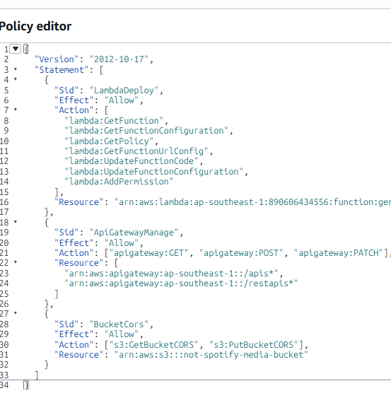

# AWS Lambda + API Gateway — presigned uploads

Personal uploads (`/uploads`) no longer stream through the ASP.NET container. The browser
uploads straight to S3, and the API only ever sees a small JSON call registering the
finished object.

```
Browser
   │ 1. POST /presign        (Bearer <app access token>)
   ▼
API Gateway (HTTP API "serverless-upload-api")
   │    AWS_PROXY, payload format 2.0
   ▼
Lambda "generatePresignedUrl" (python3.12+)
   │    verifies the JWT, validates type + size, builds the key
   └──► returns a presigned S3 POST policy
   │
   │ 2. POST the file DIRECTLY to S3  ────────────────────────►  S3 (not-spotify-media-bucket)
   │                                                              uploads/{userId}/{guid}.{ext}
   │ 3. POST /me/uploads/complete    (the monolith, on ECS)
   ▼
ASP.NET API ──► HeadObject to confirm it landed ──► RDS row
```

## Why

The old path was `POST /me/uploads`, multipart, `[RequestSizeLimit(50_000_000)]`. Every
byte crossed the ALB and sat in container memory, so the 50 MB cap was really a container
constraint rather than a product decision, and a few concurrent uploads could hurt
unrelated requests. Now the Lambda decides *where* a user may put a file and S3 enforces
that decision; the container is out of the data path entirely.

The multipart endpoint still exists and still works — see [Fallback](#fallback).

### This upgrades the console-built function in place

`generatePresignedUrl`, `serverless-upload-api` and `POST /presign` were first created by
hand in the AWS console. The script's defaults deliberately match those names, so it
**updates what is already there** rather than standing up a second copy — the deployed
resources, the IAM policy, and the screenshots of them all stay valid. The handler's entry
point is still `lambda_function.lambda_handler`, and `BUCKET_NAME` / `URL_TTL_SECONDS` keep
the environment-variable names the console version used.

What changed in the handler:

| | Console version | Now |
|---|---|---|
| Auth | none — anyone with the URL could mint an upload URL | the app's HS256 access token, verified in-process |
| Key | `uploads/{uuid}-{filename}` | `uploads/{sub}/{uuid}{ext}`, from the token's own subject |
| Size | unbounded | capped by the POST policy (`content-length-range`) |
| File type | anything | audio extension allowlist, and the extension pins `Content-Type` |
| Presign kind | PUT (single `uploadUrl`) | POST (`{url, fields}` policy) |

> **The response shape changed**, so the tutorial's Step 6 evidence (a JSON body with
> `uploadUrl`, then `curl -X PUT -T file`) no longer matches what the deployed function
> returns. Either re-take those screenshots against the new contract, or keep them labelled
> as the initial implementation and show the hardened version as the final state — the
> before/after is a stronger discussion point than either version alone.

| Piece | Where |
|---|---|
| Handler | [`serverless/uploads-presign/lambda_function.py`](../serverless/uploads-presign/lambda_function.py) |
| Tests (offline, no AWS) | [`serverless/uploads-presign/test_lambda_function.py`](../serverless/uploads-presign/test_lambda_function.py) |
| Deploy script | [`serverless/deploy-lambda.ps1`](../serverless/deploy-lambda.ps1) |
| Completion endpoint | `MeUploadsController.Complete` in [`MeUploadsController.cs`](../backend/src/NotSpotify.Api/Controllers/MeUploadsController.cs) |
| Frontend client | [`frontend/src/services/uploadService.ts`](../frontend/src/services/uploadService.ts) (+ its `.test.ts`) |

---

## Deploy

```powershell
$env:JWT_SIGNING_KEY = "<the same value the ECS task def uses for Jwt__SigningKey>"
.\serverless\deploy-lambda.ps1
```

Run it from the repo root. It is idempotent — every step checks whether the resource
exists first — so re-running it is the normal way to ship a code change. Against the
already-deployed function it pushes the code, sets the environment, refreshes the API's
CORS, adds any missing route, and leaves the console-created execution role alone. On an
empty account it creates all of it from scratch. Either way it prints the endpoint and the
exact `VITE_UPLOADS_API_URL=` line to paste into the frontend env file.

> The existing role is **not** modified. It already has `s3:PutObject` on
> `arn:aws:s3:::<bucket>/uploads/*` from the console setup, which is exactly what the
> handler needs — the script prints the role ARN so you can check it in IAM if an upload
> ever 403s.

| Flag | Use |
|---|---|
| `-CodeOnly` | Push new handler code and skip every infra step. The fast path once it is live. |
| `-RoleArn <arn>` | Reuse an existing execution role instead of creating one (e.g. an AWS Academy `LabRole`). |
| `-Bucket <name>` | Media bucket. Defaults to `not-spotify-media-bucket`. |
| `-MaxUploadMb <n>` | Upload ceiling, default 100. **Also change `MaxUploadBytes` in `MeUploadsController`.** |
| `-AllowedOrigins "<a>,<b>"` | CORS allowlist for the presign call. Defaults to the two prod origins + `http://localhost:5173`. |
| `-Region` / `-FunctionName` / `-ApiName` / `-RoleName` | Override the defaults (region defaults to `ap-southeast-1`). |

> **Run the first deploy as an admin.** The `not-spotify-app` IAM user only has ECR
> permissions and cannot create roles, functions, or APIs — the same wall the ECS rollout
> hit. Sign in as `not-spotify-admin` for the initial run, or hand it a pre-made role with
> `-RoleArn`. Later `-CodeOnly` deploys need far less.

### Two things that are easy to miss

**1. The bucket needs its own CORS rule.** API Gateway's CORS config covers the presign
call only. Step 2 goes to `bucket.s3.amazonaws.com`, a different origin governed by the
*bucket's* CORS, and without a `POST` rule the preflight fails before a byte is sent:

```bash
dotnet run --project backend/src/NotSpotify.Api -- ensure-s3-cors
```

That command **replaces the bucket's entire CORS configuration**, so a rule added by hand
in the console will be wiped the next time anyone runs it. Rules live in
`S3StorageService.EnsureBrowserCorsAsync` — edit them there. The upload rule reuses
`Cors:AllowedOrigins`, so the API and the bucket cannot drift apart.

**2. The frontend needs the URL** — but **not before a backend carrying
`POST /me/uploads/complete` is live on ECS.** Set it too early and uploads presign, reach
S3, then 404 on completion: the user sees a failure and the object is orphaned.

```
frontend/.env.production   VITE_UPLOADS_API_URL=https://dg607y4cpj.execute-api.ap-southeast-1.amazonaws.com
```

Then rebuild and redeploy the SPA. Blank means every upload silently takes the old path —
correct behaviour, but easy to mistake for the Lambda not working.

### Deployed state (2026-07-23)

| Resource | Value |
|---|---|
| Lambda | `generatePresignedUrl`, python3.12, `lambda_function.lambda_handler`, 10s / 128 MB |
| Execution role | `generatePresignedUrl-role-r6os3qx7` (console-created, left as-is) |
| HTTP API | `serverless-upload-api`, id `dg607y4cpj` |
| Endpoint | `https://dg607y4cpj.execute-api.ap-southeast-1.amazonaws.com` |
| Routes | `GET /health`, `POST /presign` — `$default` stage, auto-deploy, 10 rps / burst 20 |
| Bucket CORS | 2 rules: read (`GET/HEAD`, `*`, Range headers exposed) + upload (`POST/PUT`, app origins) |
| Backend | ECS task def `default-not-spotify-api-f33c:34` — carries `POST /me/uploads/complete` |
| Frontend | `VITE_UPLOADS_API_URL` set; bundle `index-CsrN1eCY.js` live on CloudFront `E27J84V5MFALHE` |

> The API had to be **recreated**: the one built in the console (`hwd4oafzj9`) had been
> deleted, leaving only an orphaned `lambda:InvokeFunction` statement pointing at it. The
> invoke URL is therefore different from the original screenshots. The stale permission
> statement is harmless but can be removed with
> `aws lambda remove-permission --function-name generatePresignedUrl --statement-id <sid>`.

---

## API

| Route | Auth | Notes |
|---|---|---|
| `GET /health` | none | `{ok, bucket, authConfigured, maxUploadMb, allowedExtensions}`. First thing to curl. |
| `POST /presign` | `Authorization: Bearer <access token>` | `{fileName, sizeBytes}` → a presigned POST policy. |

```bash
curl -X POST "$UPLOADS_API/presign" \
  -H "authorization: Bearer $ACCESS_TOKEN" \
  -H 'content-type: application/json' \
  -d '{"fileName":"demo.mp3","sizeBytes":4200000}'
```

```jsonc
{
  "upload": { "url": "https://…s3.amazonaws.com/", "fields": { /* policy, signature, … */ } },
  "key": "uploads/6f1c…/9ab3….mp3",
  "contentType": "audio/mpeg",
  "maxBytes": 104857600,
  "expiresIn": 900
}
```

Errors are `{"error": "<code>", "message": "<human text>"}`: `401 unauthorized`,
`422 unsupported_type` / `size_required` / `file_name_required`, `413 too_large`.

Then `POST /me/uploads/complete` on the **monolith** with `{key, title, artist, durationMs}`.
It returns the same `UserUploadDto` the old endpoint did, so the UI is unchanged.

---

## Security notes

The interesting part is that the browser now names a key. Everything below exists because
of that.

- **The Lambda verifies the app's own JWT, in-process.** API Gateway's built-in JWT
  authorizer only speaks OIDC/JWKS, and the monolith issues symmetric **HS256** tokens
  with no JWKS endpoint, so it cannot be used. Verification is ~40 lines of `hmac` +
  `hashlib` — no PyJWT, which keeps the deploy zip a single file. It checks signature,
  `exp`/`nbf` (30s skew), `iss`, `aud`, and that `sub` is a UUID, and it **rejects any
  `alg` that is not HS256** — that allowlist is what stops the classic `alg: none` forgery.
  Tests cover each of those rejections.
- **The client never chooses the key.** It is built server-side as
  `uploads/{sub}/{uuid4}{ext}` from the token's own subject. A `key` in the request body
  is ignored (there is a test for it).
- **The extension decides the content type, not the browser.** Windows reports `.flac` as
  `application/octet-stream` often enough that trusting the client breaks real uploads.
  The policy then pins the exact `Content-Type` S3 will accept.
- **A presigned POST, not a PUT** — specifically for `content-length-range`. A presigned
  PUT cannot cap the body, so a client could ignore the `sizeBytes` it declared and stream
  gigabytes into the bucket. With the POST policy S3 rejects it.
- **The execution role is `s3:PutObject` on `arn:aws:s3:::<bucket>/uploads/*` and nothing
  else.** A presigned URL inherits the signer's permissions, so this role's scope *is* the
  blast radius: no `GetObject`, no `DeleteObject`, nothing outside the prefix. A bug in
  the key builder cannot produce a URL that overwrites catalogue audio.
- **`/complete` re-derives everything it can.** Ownership comes from the key's own prefix
  (with an explicit check that the remainder is a flat filename, or
  `uploads/{me}/../{them}/x.mp3` would pass a naive `StartsWith`), existence and size come
  from `HeadObject`, and a second call with the same key is a `409` rather than a duplicate
  row. The browser's claim that the upload succeeded is not evidence.

### The trade-off worth stating

**The JWT signing key now lives in two places** — the ECS task definition and the Lambda's
environment. That is the cost of verifying app tokens outside the app. If it is rotated,
both must be updated together or every upload 401s. The alternatives were worse for this
project: an OIDC issuer the gateway could validate, or minting a separate short-lived
upload token in the monolith (which puts the monolith back in the request path).

---

## Verify a deploy

```bash
curl "$UPLOADS_API/health"
```

Expect `"authConfigured": true` and the right bucket. Then upload a file from `/uploads`
and confirm in the browser devtools **Network** tab that the large request goes to
`*.s3.amazonaws.com`, not to `api.not-spotify.lol`. Logs are in CloudWatch under
`/aws/lambda/generatePresignedUrl`.

Run the offline suites before deploying — neither needs AWS credentials or a network:

```bash
py -m unittest discover -s serverless/uploads-presign
```

```bash
cd frontend && npx vitest run src/services/uploadService.test.ts
```

```bash
cd backend && dotnet test --filter "FullyQualifiedName~MeUploadsControllerTests"
```

## Fallback

`uploadService.upload()` uses the direct path only when `VITE_UPLOADS_API_URL` is set, and
falls back to the multipart endpoint when the presign service is **unreachable or returns
5xx**. It deliberately does *not* fall back on a 4xx: a rejection about the file itself
(too large, wrong type, not signed in) is shown to the user, because retrying it through
the API would either fail again or quietly bypass the limit the Lambda just enforced.

So the app runs fine with no Lambda deployed — you just get the old 50 MB
through-the-container behaviour.

## Known limits

- **Nothing cleans up orphans.** If the browser uploads to S3 and then never calls
  `/complete` (tab closed, crash), the object stays in the bucket with no DB row. An S3
  lifecycle rule expiring `uploads/` objects older than a day would need pairing with a
  "registered" marker; a scheduled reconciliation Lambda is the fuller fix.
- **The 100 MB cap is set in two places** — `MAX_UPLOAD_BYTES` on the Lambda and
  `MaxUploadBytes` in `MeUploadsController`. S3 enforces the real limit; the C# constant
  is the backstop if they drift.
- **No multipart/resumable upload**, so a dropped connection on a large file starts over.
  S3 multipart would need a different presign shape (per-part URLs + a completion call).
- **The allowed-extension list is duplicated** between the Lambda and
  `MeUploadsController.AllowedAudioExts`. Accepting something in the Lambda that the API
  rejects would leave an orphaned object.
- **No virus/content scanning.** The bucket accepts whatever bytes match the policy; only
  the extension and size are checked, never the file's actual contents.
